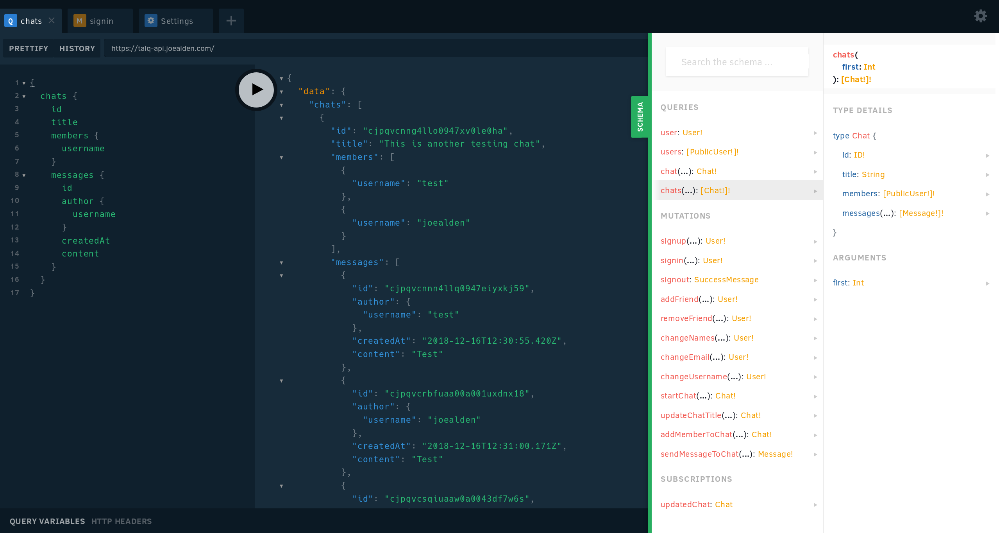

<h1 align="center">Talq API</h1>
<p align="center">The API for Talq built with Prisma and graphql-yoga.</p>



## Main Talq Repository

Visit https://github.com/joealden/talq-client-web to see the front-end code that uses this API.

## Usage


### **IMPORTANT**

Before running either the development or the production server, it is important
that a `.env` file has been created in the root of the project with the following
environment variables:

* `APP_PORT` (Number) - The port to run the development server on.
* `FRONTEND_URL` (String) - The address of the front-end of the site.
* `PRISMA_ENDPOINT` (String) - The Prisma service endpoint (see below section).
* `PRISMA_SECRET` (String) - The secret that will be used to setup the Prisma service.
* `APP_SECRET` (String) - The secret that will be used to secure the API.

An example `.env` file can be found at `.env.example`.

### Setting up a Prisma Service for the API

Before proceeding, please ensure that you have made a `.env` file with at least the
`PRISMA_SECRET` and `APP_SECRET` filled in. This is because the below command needs
to use these two variables to secure the Prisma service.

Run this command and follow the instructions given:

```bash
yarn prisma deploy
```

The command above will setup a Prisma service for the API. Think of a Prisma service
as the interface between the API server and the database. The above command should give
a Prisma service endpoint that you will need to insert into the `.env` file.

### Development

To start the development server, run the following commands:

```
yarn
yarn dev
```

### Production

To build the production files and start the production server, run the following
commands:

```
yarn
yarn build
yarn start
```
